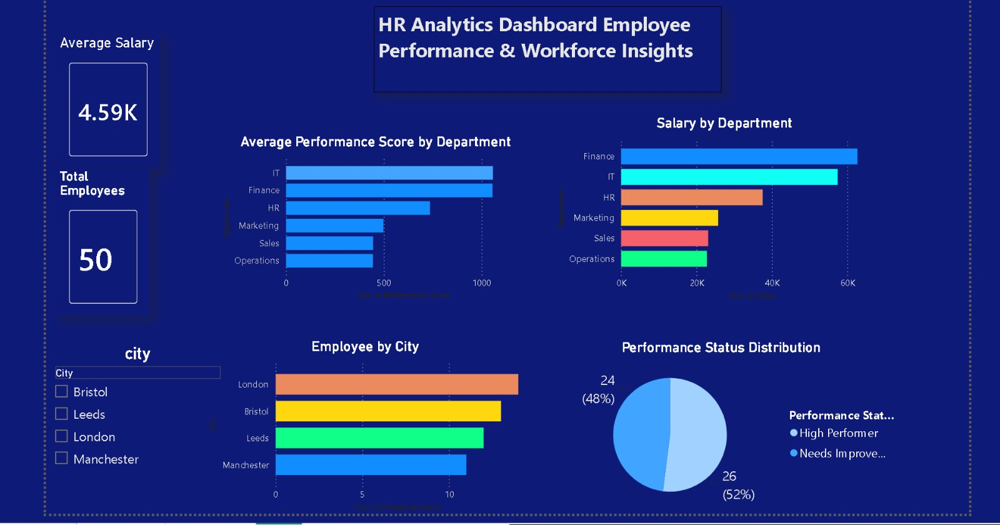

# HR Analytics Dashboard

## Project Overview
This Power BI dashboard provides insights into employee performance, salary distribution, department-wise analysis, and workforce trends.
## Dataset

Dataset File: [HR_Analytics_Data.xlsx](HR_Analytics_Data.xlsx)
The dataset contains:
- Employee ID
- Employee Name
- Department
- City
- Salary
- Performance Score
- Performance Status

## Key Objectives
- Analyse employee performance across departments.
- Compare salary distribution by department.
- Monitor workforce distribution by city.
- Track high performers and employees needing improvement.
- Provide HR insights for better decision making.

## Dashboard Features
- KPI Cards (Average Salary, Total Employees)
- Salary by Department Analysis
- Performance Score by Department
- Employee Distribution by City
- Performance Status Distribution
- Interactive City Filter

## Tools Used
- Power BI
- Microsoft Excel
- Data Visualisation

## Dashboard Preview
The following image shows the final HR Analytics Dashboard created in Power BI.

## Insights
- Finance department has the highest salary distribution.
- IT and Finance show strong performance scores.
- Employee distribution varies across cities.
- Majority of employees are categorized as High Performers.

## Created by 
Sandhya rani  Donikana

Email: sandhyadonikana@gmail.com
